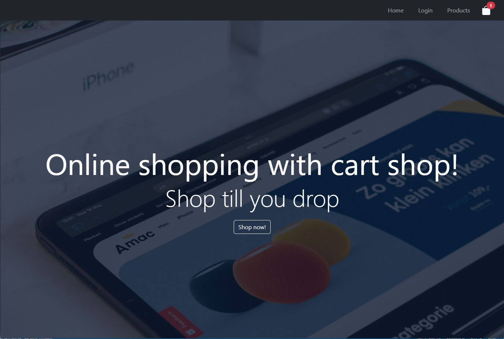
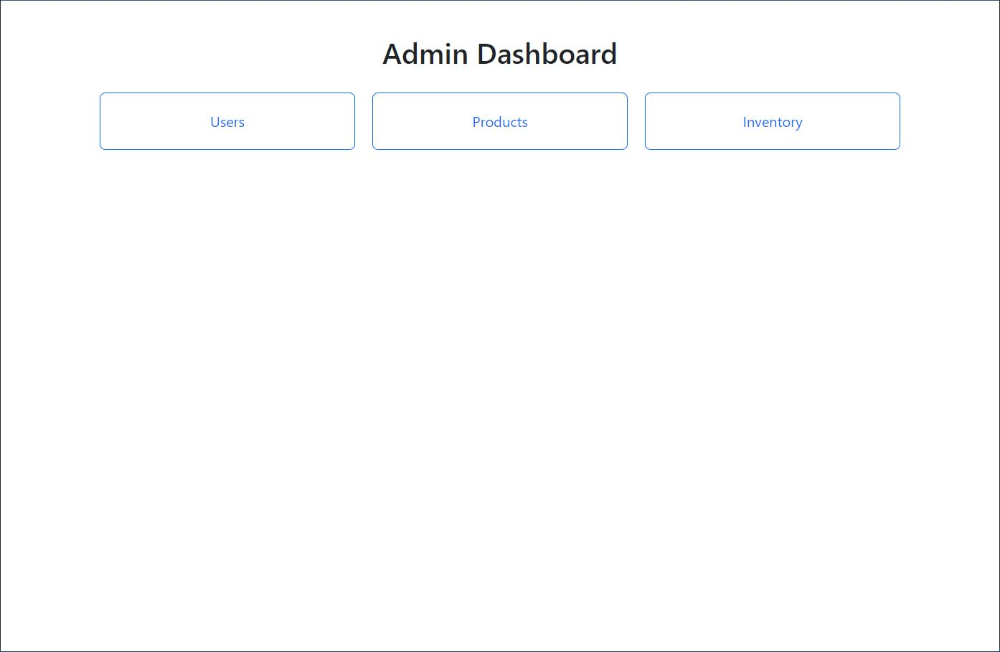

<h1 align="center">Simple Shopping Cart System</h1>

This is just a simple web application project for me to get started with full stack development. This is not a complete and fully working shopping cart system, a lot of functionality are still needed. My goal is to just get started and try other web frameworks and languages.

The application have admin dashboard in order to view the users, products, edit products and edit users credentials.

## Sample Screenshots

### Public (Home page)



### Admin Dashboard (Admin)



## Installation

```bash
git clone https://github.com/dwarjie/shopping-cart.git
cd shopping-cart
```

### Running server

> You need MySQL Server running
> and configure the database configuration at 'server/app/config/db.config.js'

```bash
cd server
npm run dev
```

### Running client

```bash
cd client
npm start
```

## Language Used

- ReactJS
- Bootstrap 5
- NodeJS
- ExpressJS
- Sequelize
- MySQL

> # **NOTE**
>
> This project is not completely finished. I might comeback and add more functionality.
